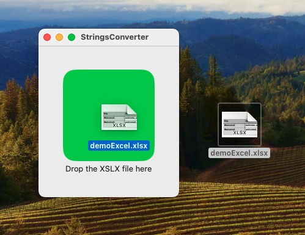
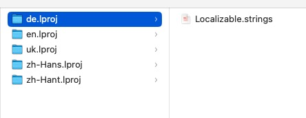
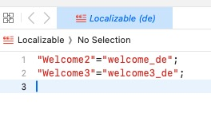
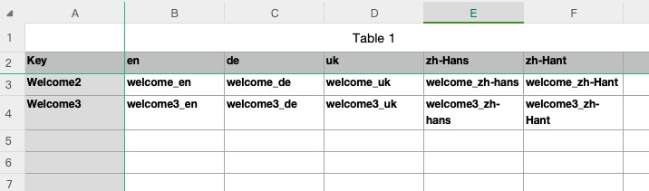

# xslxToStrings
A tool to convert xslx file to iOS strings file

you can drop your xslx file to this application to generate iOS/MacOS strings file

the generated file folder:

strings file detail:

At first, you should use the xslx Template file like this to generate strings.

